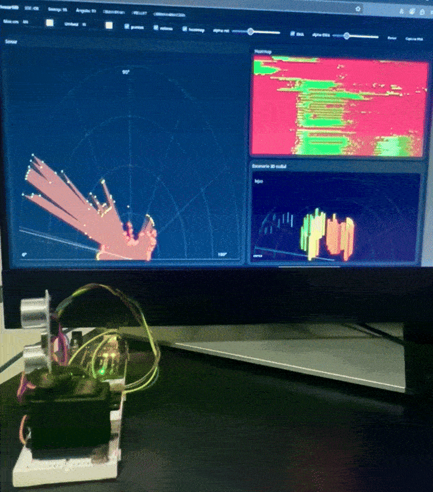
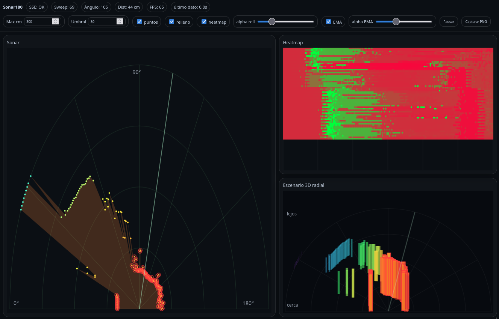
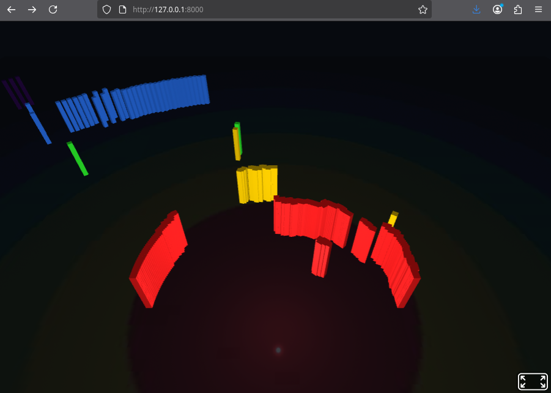

# sonar180
Great precission and compact end-to-end ultrasonic scanning system that performs a 180° sweep, streams distance data in real time, and renders it live in the browser as a radar, heatmap, and radial 3D visualization.



## Overview




The system is composed of three layers:

1. **Arduino firmware**
   - Drives a servo from 0–180°.
   - Triggers an ultrasonic sensor at each angle.
   - Outputs measurements over serial as:
     ```
     angle:distance
     ```
     Example: `72:135` (72°, 135 cm).

2. **Python backend**
   - Reads the serial stream.
   - Maintains the latest distance per angle (0–180).
   - Detects sweep direction changes and full sweeps.
   - Exposes a lightweight HTTP server.
   - Streams data to the browser using **SSE (Server-Sent Events)**.

3. **Web frontend**
   - No build step, pure HTML/JS.
   - Real-time visualizations:
     - 2D semicircular radar.
     - Time-scrolling heatmap (per sweep).
     - Radial pseudo-3D bar scene.
   - Live controls (range, threshold, smoothing, pause, capture).

---

## Highlights / Key Technical Features

- **Dynamic echo waiting**
  - The Arduino firmware does not use a fixed blocking delay.
  - Echo wait time is dynamically bounded, allowing **fast returns at short distances** while still supporting **accurate long-range measurements**.
  - This maximizes sweep speed without sacrificing precision.

- **True 180° continuous sweep**
  - Servo movement is monotonic with direction tracking.
  - Direction changes are detected on the backend to delimit **complete sweeps** reliably.

- **Per-angle state model**
  - One distance value per degree (0–180).
  - Constant-time updates and rendering.
  - No frame-based recomputation or resampling.

- **Sweep-aware data streaming**
  - Backend emits:
    - single-point updates (low latency),
    - full sweep snapshots (coherent frames),
    - sweep boundary events.
  - Enables heatmaps and temporal analysis without guesswork.

- **Low-latency real-time transport**
  - Uses **Server-Sent Events (SSE)** instead of polling or WebSockets.
  - Stateless, efficient, and browser-native.

- **Optional EMA smoothing**
  - Exponential Moving Average per angle.
  - Reduces ultrasonic noise while preserving spatial structure.

- **Multiple synchronized views**
  - Radar (geometric accuracy).
  - Heatmap (temporal persistence).
  - Radial 3D bars (depth perception).

- **Distance-coded color pipeline**
  - Unified color logic across all views.
  - Near/far separation is immediately readable.

- **Zero build, zero framework frontend**
  - Single HTML page.
  - No bundler, no transpilation, no dependencies.

- **Sensor-agnostic architecture**
  - Serial protocol and backend logic are generic.
  - Can be reused with LiDAR, ToF, IR, or RF ranging sensors with minimal changes.
 
---

## Visualizations

- **Radar**: current sweep with distance-coded colors.
- **Heatmap**: vertical history of completed sweeps.
- **Radial 3D scene**: bars positioned by angle and distance, color-graded from near to far.

---

## Files

- `sketch_sonar.ino`  
  Arduino firmware (servo + ultrasonic sensor, serial output).

- `sonar.py`  
  Full dashboard version (radar + heatmap + radial 3D, Canvas-based).

- `sonar_aframe.py`  
  Minimal version using **A-Frame** for a true 3D scene in the browser.

---

## Requirements

### Hardware
- Arduino (Uno / Nano / compatible)
- Servo motor
- Ultrasonic sensor (HC-SR04 or similar)

Wiring:
- SENSOR: VCC to 5V. GND to GND. TRIGGER to D8. ECHO to D7.
- SERVO: VCC to 5V. GND to GND. SIGNAL to D9. 


### Software
- Python ≥ 3.8
- Python dependency:  pip install pyserial

### How to use

- Upload sketch_sonar.ino to your Arduino
- Keep conected to PC to use serial port
- Run one of the python servers:

`python3 sonar.py --port /dev/ttyACM0 --baud 115200 --http 8000`

or

`python3 sonar_aframe.py --port /dev/ttyACM0 --baud 115200 --http 8000`

(Adjust the serial port if needed, e.g. COM3 on Windows.)

Open the dashboard using your browser: http://127.0.0.1:8000

---

## LICENSE

 CC BY 4.0
